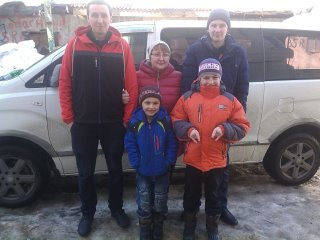

Меня зовут Надежда
Мне 50 лет
По образованию я санитарный врач,
кандидат медицинских наук,
в прошлом преподаватель кафедры гигиены, медицины труда и охраны здравоохранения.
Я мама четырех сыновей.
Сейчас выйдя на пенсию я решила освоить новую профессию

